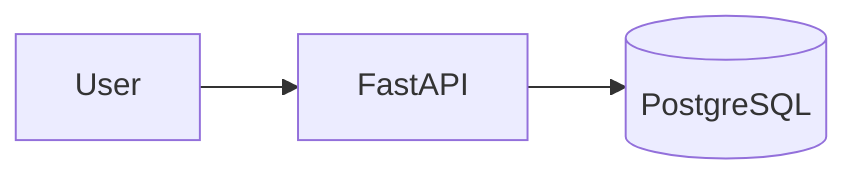
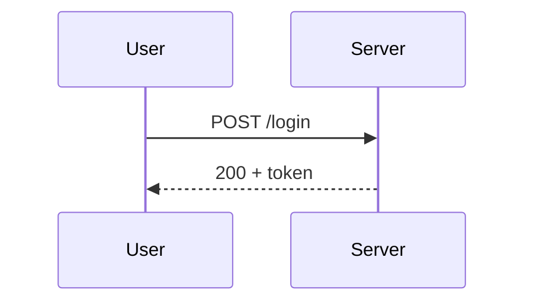
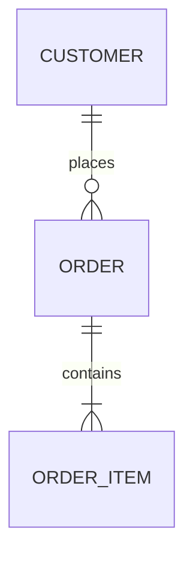
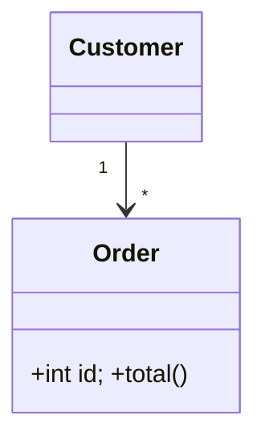
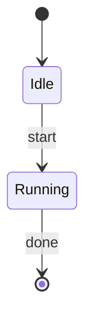
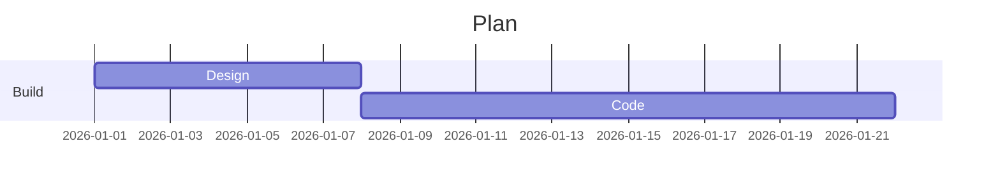
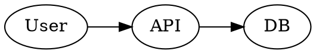

# Create a diagram (Mermaid / Graphviz)

Default to **Mermaid**: it embeds directly in Markdown and renders on GitHub,
GitLab, VS Code, Obsidian, and Notion — no build step. Put it in a fenced block:

<pre>```mermaid
flowchart TD
    A[Start] --> B{Authed?}
    B -- yes --> C[Dashboard]
    B -- no --> D[Login]
    D --> B
```</pre>

## Pick the diagram type








## Syntax tips

- Node shapes: `[rect]`, `(round)`, `([stadium])`, `{rhombus}`, `[(database)]`.
- Edges: `-->`, `---`, `-- label -->`, `-.->` (dotted), `==>` (thick).
- Quote labels with spaces/special chars: `A["Place order"]`. `subgraph name ... end`
  groups nodes. Keep one statement per line.

## Render to an image (optional)

- **Mermaid CLI**: `npx -y @mermaid-js/mermaid-cli -i diagram.mmd -o diagram.svg`
  (or `.png`). Preview/export at https://mermaid.live.
- **Graphviz** when you need fine layout control: write DOT and run
  `dot -Tsvg graph.dot -o graph.svg`.



## Validate

- The Mermaid block parses (paste into mermaid.live or render with mmdc).
- Node/edge labels with spaces are quoted; every `subgraph` has an `end`.
- The diagram matches the described relationships/flow.
